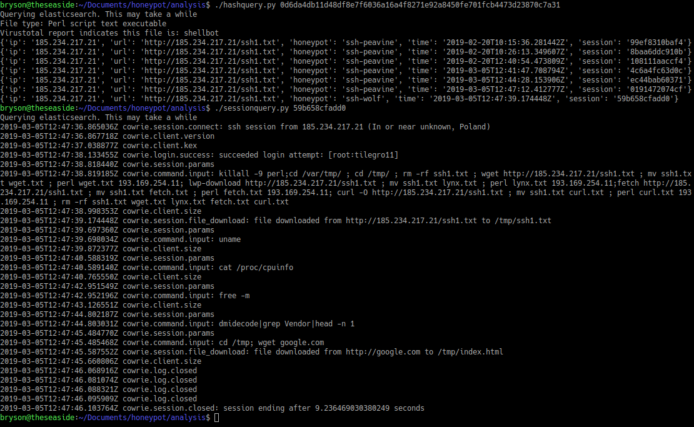

# Honeypot scripts

## Description

- collectfiles.sh : downloads files from the honeypots to new-files/ folder. Will ask for passwords for all 3 honeypots.
- file-logger.py : for each file in new-files/, create a log event for that file if one does not exist and moves the file to checked-files/. Deletes empty files. Files that are not found on virustotal are uploaded, and remain in new-files/.
- hash-query.py : takes a hash as arg 1 and makes a query to elasticsearch to find sessions where that file was downloaded. Returns attacker ip, the url the file was obtained from, the honeypot hosting the session, the timestamp, and the session id.
- session-query.py : takes a session id as arg 1 and makes a query to elasticsearch to find describe that session. Returns the entire session, in order.

The last 2 scripts assume that elasticsearch is running on 127.0.0.1:9200. I use an ssh tunnel to run the scripts on my local machine.

If VirusTotal information is not needed, almost all the code under `if "executable" in ftype:` in file-logger.py can be safely deleted.

## Example Usage

